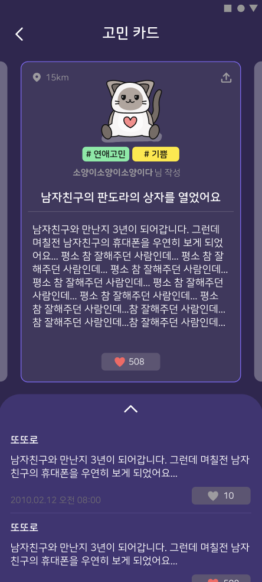

# Mystical Animal Counseling

## Description
신비로운 동물상담소에서는 다양한 동물들이 깊은 밤에 사람들의 고민을 해결해주어요.
연애, 학업, 직업, 인간관계, 음식,기타 고민들 모두 신비로운 동물상담소에서 해결해보세요!

## Developer

- [김유정](https://github.com/YuChocopie)
- [박서희](https://github.com/seohui548)
- [이진성](https://github.com/dlwls5201)

## Commit Rule

- 🛠refactor : 새로운 기능이 아닌 코드를 재정비 하였을 때 (변수 이름 바꾸기)
- 🐛fix : 버그 수정
- 🧸feat : 새로운 기능 추가
- 🧀chore : 빌드 업무 수정, 패키지 매니저 수정
- 🌱docs : 문서 변경
- 🍰test : 누락된 테스트 추가, 생산적인 코드 생성은 없음

## Project

- app 모듈과 data 모듈 분리 작업
- 네이티브와 이 합쳐진 하이브리드 앱

{: width="100" height="100"}
{: width="100" height="100"}

## Spec

- MVVM Architecture Pattern
- Databinding
- RxJava3

## Third party

- [Retrofit](https://square.github.io/retrofit/)
- [Okhttp](https://square.github.io/okhttp/)
- [Glide](https://bumptech.github.io/glide/doc/getting-started.html)
- [RxAndroid3](https://github.com/ReactiveX/RxAndroid/tree/3.x)

